[TOC]

# 数字图像处理hm1

## 一、直方图均衡

> 实现river.jpg 图像的直方图均衡，不能直接使用Matlab的histeq( )函数。将有 关均衡图像和调用histeq( )函数的结果作比较。

### 算法描述

直方图均衡化属于图像增强的一种，通过在空间域上对图像的像素值进行非几何变换，可以对图像的对比度进行拉伸调整，增强局部的对比度而不影响整体的对比度，有效地扩展常用的亮度。对于背景和前景都太亮或者太暗的图像非常有用，这种方法可以将更好显示X光图像中的骨骼结构以及曝光过度或者曝光不足照片中的细节。这种方法的一个主要优势是它是一个相当直观的技术并且是可逆操作，如果已知均衡化函数，那么就可以恢复原始的直方图，并且计算量也不大。这种方法的一个缺点是它对处理的数据不加选择，它可能会增加背景噪声的对比度并且降低有用信号的对比度。

由于给的river.jpg为离散的灰度图像，让 *ni* 表示灰度 *i* 出现的次数，*L* 是图像中所有的灰度数（通常为256），n 是图像中所有的像素数，这样图像中灰度为 *i* 的像素的概率密度函数是

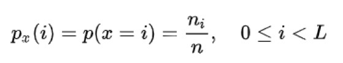

对应于 *px* 的累积分布函数为：

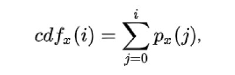

然后根据一个*s* = *T*(*r*) 的变换，将原图像的灰度值映射，得到的图像的直方图就近似满足均衡分布，之所以是近似，因为灰度值的类型在matlab中为uint8，必须将线性变换后的灰度值四舍五入到整数才可以保存。

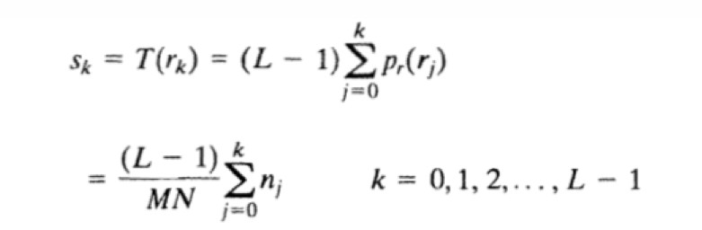

此变换函数满足条件：

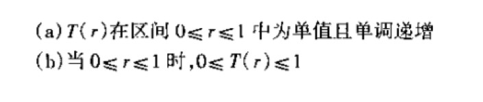

### 具体实现

```Matlab
%  pro1/src/pro1.m

clear all;
% 读取图片到矩阵，矩阵元素为灰度值，下标为图片的几何坐标，注意从下标1开始，而坐标从0开始
f = imread('../river.JPG');
[height,width] = size(f)
% 查看图片信息
% whos f
% imfinfo ../river.JPG

% 直方图均衡化算法
g = my_histeq(f,256);

% 用histeq接口得到的图像作为测试
h = histeq(f,256);

%显示原图像、均衡化后，以及histeq返回的图像
%显示原图像、均衡化后，以及histeq返回的直方图
figure;
subplot(2,3,1),imshow(f);title('origin image');
subplot(2,3,2),imshow(g);title('hist equal image');
subplot(2,3,3),imshow(h);title('histeq test image');
subplot(2,3,4),imhist(f);title('origin hist');
subplot(2,3,5),imhist(g);title('hist equal hist');
subplot(2,3,6),imhist(h);title('histeq test image');
```

```matlab
% pro1/src/my_histeq.m

function f_equal = my_histeq(f,L)
    [height,width] = size(f);
    %（1，L）灰度级为L，返回每个灰度值（0～L-1）的个数
    hr = imhist(f,L);
    % 归一化
    pr = hr / numel(f);
    % （L-1）*cdf，线性变换函数
    s = round((L-1)*cumsum(pr));
    % 映射
    f_equal = f;
    for i=1:height
        for j=1:width
            f_equal(i,j) = s(f(i,j));
        end
    end
    % 写回文件
    imwrite(f_equal,'../result/myhisteq_img.jpg')
end
```

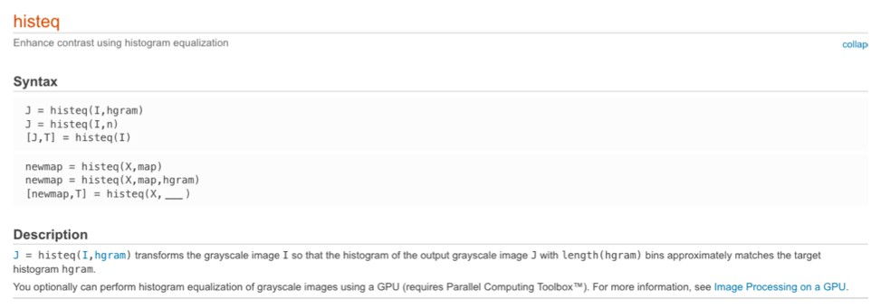


### 实验效果


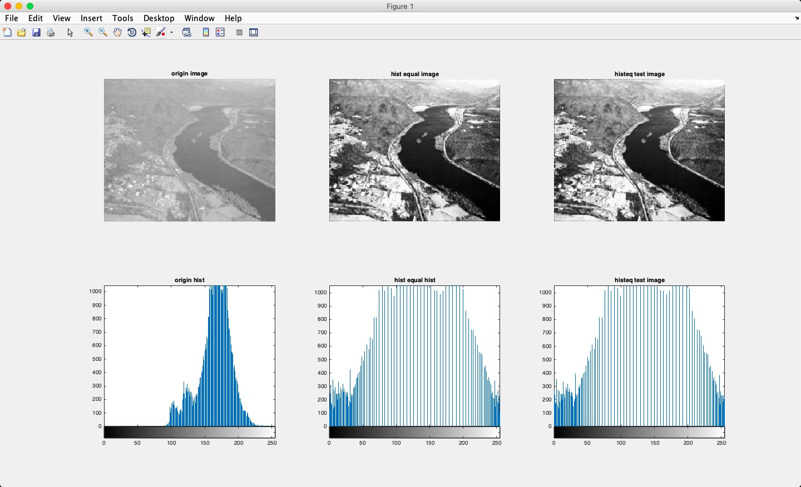

第一列为原始图像及直方图，第二列为实现均衡化后的图像及直方图，最后一列为使用histeq后测试得到的图像和直方图。


## 二、直方图规定化（匹配）

> 将 图 像 EightAM.png 的 直 方 图 匹 配 为 图 像 LENA.png 的 直 方 图 ， 显示 EightAM.png在直方图匹配前后的图像，并绘制LENA.png的直方图、直方图匹配 前后EightAM.png的直方图，检查直方图匹配的效果。

### 算法描述

直方图匹配又称为直方图规定化，是指将一幅图像的直方图变成规定形状的直方图而进行的图像增强方法。 即将某幅影像或某一区域的直方图匹配到另一幅影像上，使两幅影像的色调保持一致。

由于两张给定图片还是为离散的灰度图像，假设r为输入图像EightAM.png的灰度值，z为输出得到的灰度值，s为输入图像经过直方图均衡化后的灰度值。一般情况的灰度变换，只需要一次映射：r->s，例如直方图均衡化。而直方图匹配，需要两次映射，r->s->z。

首先将输入图像进行直方图均衡化得到对应的s值。

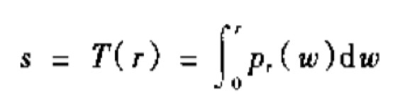

然后将匹配直方图的图像同样均衡化得到对应的s值。

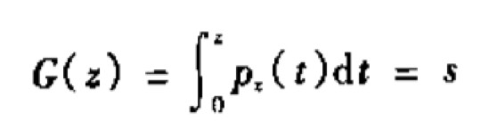

因为离散的s变量的概率密度函数近似为均匀分布，也就是说s与r的概率密度函数无关。同样对于z经过直方图均衡化后的s变量与z的概率密度函数也无关。所以s可以作为中间变量连接输入和输出灰度值。

又由于要输出的z值不确定，但已经规定好了z变量服从的概率密度函数，即由lena图片的直方图决定，所以可以将s反变换得到想要的z值。

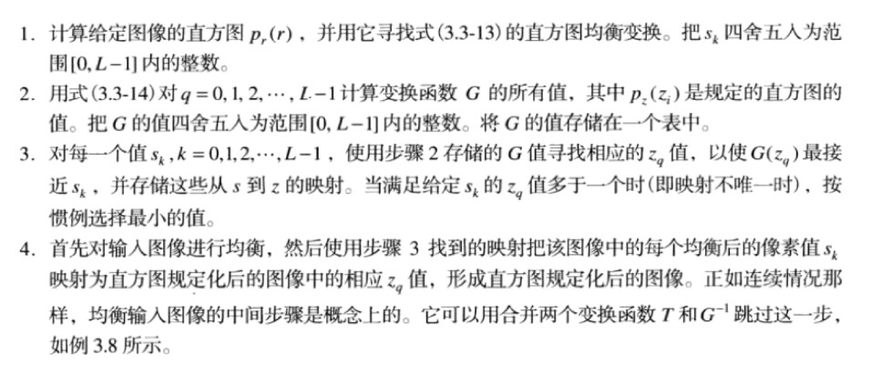


### 具体实现

```Matlab
% pro2/src/pro2.m

clear all;

lena_img = imread('../LENA.png');
eight_img = imread('../EightAM.png');

% 直方图匹配算法
g = my_histmatch(eight_img,lena_img);

% 用imhistmatch接口得到的图片作为测试
t = imhistmatch(eight_img,lena_img);
% 或者使用histeq(eight_img,imhist(lena_img))结果相同

%从左到右显示原图像、匹配图像，匹配后的以及imhistmatch返回的图像
%从左到右显示原图像、匹配图像，匹配后的以及imhistmatch返回的直方图
figure;
subplot(2,4,1),imshow(eight_img);title('origin image');
subplot(2,4,2),imshow(lena_img);title('reference image');
subplot(2,4,3),imshow(g);title('my match image');
subplot(2,4,4),imshow(t);title('test match image');
subplot(2,4,5),imhist(eight_img);title('origin hist');
subplot(2,4,6),imhist(lena_img);title('reference hist');
subplot(2,4,7),imhist(g);title('my match image');
subplot(2,4,8),imhist(t);title('test match image');
```

```matlab
% pro2/src/my_histmatch.m

function  h = my_histmatch(f,g)
    [height_f,width_f] = size(f)
    [height_g,width_g] = size(g)

    hist_f = imhist(f);
    hist_g = imhist(g);

    cdf_f = cumsum(hist_f) / numel(f); 
    cdf_g = cumsum(hist_g) / numel(g);
    
    % 建立r->z映射
    M   = zeros(1,256);
    for i = 1 : 256
        % 对每一个灰度值，寻找与通过G(z)得到的s值差最小的那一项，其下标减少1即为对应的z灰度值。
        [tmp,ind] = min(abs(cdf_f(i) - cdf_g));
        % 将坐标减1变为灰度值
        M(i) = ind-1;
    end
    % 新图进行灰度变换
    h = f;
    for i=1:height_f
        for j=1:width_f
            h(i,j) = M(f(i,j)+1);
        end
    end
    imwrite(h,'../result/my_histmatch.jpg')
end
```

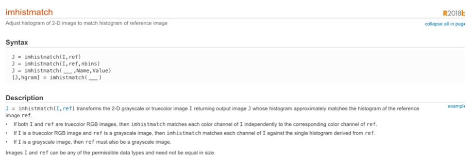

### 实验效果

根据算法得到的

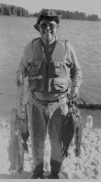

使用imhistmatch或者histeq得到的


对比


