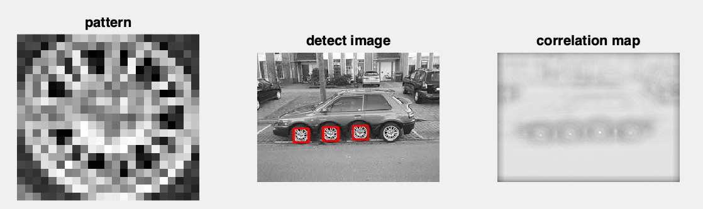

# 《数字图像处理》homework2

## 一、第一题

给定图像car.png和模版图像wheel.png，利用相关检测实现对car图像中的 wheel检测，具有最大相关值的位置可以解释为所检测到的wheel位置。程序的输入是图像和模版，要求： 

（i）显示图像的相关值结果； 

（ii）列出在图像中检测到的所有目标的（x，y）坐标。

## 1、算法描述

相关检测问题就是在car.png中寻找与模版wheel.png相匹配的所有位置，用大小为(2k+1)x(2k+1)的空间滤波器H(x,y)在F(x,y)的每个像素点计算对应矩阵元素的乘积和并进行单位化，与卷积不同的是，此filter不需要提前翻转180度，得到的相关值矩阵中最大值的出现位置即为图像的匹配位置。


注意对匹配的部分做单位化：

$$
G(i,j)=\frac{\sum_{u=-k}^k\sum_{v=-l}^lH(u,v)F(i+u,j+v)}{norm(H)*norm(F(i,j))}
$$

其中：
$$
norm(H)=(\sum_{u=-k}^k\sum_{v=-l}^lH(u,v)^2)^\frac{1}{2}
$$

$$
norm(F(i,j))=(\sum_{u=-k}^k\sum_{v=-l}^lF(i+u,j+v)^2)^\frac{1}{2}
$$

由于得到的相关值矩阵需要与原图像的灰度矩阵大小相同，需要在边缘进行same padding处理。

相关检测的步骤：

1. 原图像same padding作为输入图像
2. 移动相关核的中心元素，使它位于输入图像待处理像素的正上方
3. 将输入图像的像素值作为权重，乘以相关核
4. 将上面各步得到的结果相加并进行单位化做为输出
5. 将输出值映射到0-255的uint8，然后输出correlation_map
6. 对整个相关值矩阵进行排序，得到最大的几个坐标

**另一种方法使用matlab中的corrcoef函数对每个区域内的图像和filter进行相关系数的计算，剩余单位化步骤和排序与上面相同**


## 2、代码

1. 由于都是灰度图像，直接读入

```matlab
clear

car_img = imread('../car.png');
wheel_img = imread('../wheel.png');

[height,width] = size(car_img)
[m,n] = size(wheel_img)
```

2. 对原图像进行same padding

```matlab
cpad = floor(n/2)
rpad = floor(m/2)
pad_img = padarray(car_img,[rpad cpad],0,'both');
```

3. 进行相关滤波并保证correlation_map在0-1之间

```matlab
% correlation_map的大小与原图像相同
G = zeros(height,width);
% uint8 -> double 
pattern = double(wheel_img(:));  
% 矩阵二范数
norm_sub = norm(pattern);  

for i=1:height
    for j=1:width
        subMatr=pad_img(i:i+m-1,j:j+n-1);  
        windows=double(subMatr(:));  
        norm_windows = norm(windows);
        % 单位化
        G(i,j)=sum(sum(windows.*pattern)) / (norm_sub*norm_windows);
    end  
end  
```

4. 对correlation_map进行排序，返回最大的6个坐标

```matlab
% 转换成行向量
array = reshape(G,[1,height*width]);
% 排序
[e,I] = sort(array,'descend');
% 得到矩阵坐标，取最高的六个
for i = 1:6
  x(i) = mod(I(i),height)+1;
  y(i) = ceil(I(i) / height);
end
```

5. 画图

```matlab
figure,  
subplot(1,3,1) , imshow(wheel_img),title('pattern'),set(gca,'FontSize',20);
subplot(1,3,2) , imshow(car_img),title('detect image'),set(gca,'FontSize',20);
% 对每个坐标为中心，按照pattern的大小画出矩形框
for i = 1:length(x)
	hold on  
	plot([y(i)-rpad,y(i)+n-1-rpad],[x(i)-cpad,x(i)-cpad],'-r','LineWidth',3);  
	plot([y(i)+n-1-rpad,y(i)+n-1-rpad],[x(i)-cpad,x(i)+m-1-cpad],'-r','LineWidth',3);  
	plot([y(i)-rpad,y(i)+n-1-rpad],[x(i)+m-1-cpad,x(i)+m-1-cpad],'-r','LineWidth',3);  
  	plot([y(i)-rpad,y(i)-rpad],[x(i)-cpad,x(i)+m-1-cpad],'-r','LineWidth',3);  
  	% plot(y(i),x(i),'r.')
end
% 显示相关值矩阵，注意转换成uint8
subplot(1,3,3) , imshow(uint8(255*G)),title('correlation map'),set(gca,'FontSize',20);
```


## 3、图像结果

1. 使用乘积和的方式得到的结果只有前三个轮子的坐标是在相关值最大的几个坐标中。

第三张是图像的相关值结果



相关值最大的三个坐标分别为：

1. （117，150）
2. （119，107）
3. （121，64）

图中的红点为检测到的坐标


2. 使用相关系数得到的最大6个坐标中，前5个分别是前三个轮子的，最后一个是第四个轮子的坐标，比前一种方法要好。

```matlab
for i=1:height
    for j=1:width
        subMatr=pad_img(i:i+m-1,j:j+n-1);  
        windows=double(subMatr(:));  
        norm_windows = norm(windows);
        % 计算相关系数矩阵的和
        G(i,j) = sum(sum(corrcoef(windows,pattern)));

    end  
end  
```


最大的几个坐标为：

1. （118，150）
2. （120，107）
3. （122，64）
4. （122，63）
5. （120，106）
6. （119，195）


## 二、第二题


## 1、算法描述

中值滤波是一种非线性滤波器，经常用于去除图像或者其它信号中的椒盐噪声。通过在滤波器窗口内对原图像的像素值进行排序，并将中心像素值替换成中值，比同尺寸的线性平滑滤波器的模糊程度明显降低。

通常选择窗的大小使得窗内的数据个数为奇数个，是因为奇数个数据才有唯一的中间值。

与线性平滑滤波器的比较：

1. 均值滤波对高斯噪声表现较好，对椒盐噪声表现较差。中值滤波采用非线性的方法，它在平滑脉冲噪声方面非常有效,同时它可以保护图像尖锐的边缘，选择适当的点来替代污染点的值，所以处理效果好，对椒盐噪声表现较好，对高斯噪声表现较差。
2. 对异常值有鲁棒性强

具体步骤见代码注释

## 2、代码

```matlab
clear;

car_img = imread('../sport_car.pgm');
[height,width] = size(car_img)
% 产生2个独立、在区间 [0,255] 内均匀分布的随机矩阵 t1(x,y) 和 t2(x,y)
% 注意每个坐标中的t1值大于t2
for i = 1:height
	for j = 1:width
		r1 = randi([0,255]);
		r2 = randi([0,255]);
		if r1 < r2
			t = r1;
			r1 = r2;
			r2 = t;
		end
		t1(i,j) = r1;
		t2(i,j) = r2;
	end
end
```

```matlab
% 产生椒盐噪声图像
for i = 1:height
	for j = 1:width
		if car_img(i,j)>t1(i,j)
			salt_img(i,j) = 255;
		elseif car_img(i,j)<t2(i,j)
			salt_img(i,j) = 0;
		else
			salt_img(i,j) = car_img(i,j);
		end
	end
end
```

```matlab
% 采用 3 x 3 窗口实现中值滤波

% 窗口大小
n = 3;
% unit8 -> double
s1 = double(salt_img);
mf_img = s1;

for i = 1:height-n+1
	for j = 1:width-n+1
		% 获得区域图像
		subMatr = s1(i:i+(n-1),j:j+(n-1));
		% 转换成行向量
		array = reshape(subMatr.',1,9);
		% 得到中值
		med = median(array);
		% 将中心像素的值做替换
		mf_img(i+(n-1)/2,j+(n-1)/2) = med;
	end
end

mf_img = uint8(mf_img);
```

```matlab
% 显示原图像、椒盐噪声图像、中值滤波图像，并和采用Matlab 的结果做比较。
test_img = medfilt2(salt_img);

subplot(2,2,1) , imshow(car_img),title('origin image'),set(gca,'FontSize',20);
subplot(2,2,2) , imshow(salt_img),title('noise image'),set(gca,'FontSize',20);
subplot(2,2,3) , imshow(mf_img),title('image with my implementation '),set(gca,'FontSize',20);
subplot(2,2,4) , imshow(test_img),title('medfilt2 image'),set(gca,'FontSize',20);
```


## 3、图像结果


如果使用imnoise，用椒盐噪声污染图像，得到的效果是


```matlab
% 默认的噪声密度为0.05
salt_img = imnoise(car_img,'salt & pepper');
```


当噪声密度为0.4时


