# Assignment 3

<script type="text/javascript" src="http://cdn.mathjax.org/mathjax/latest/MathJax.js?config=default"></script>


[数学公式显示请先安装Chrome插件](https://chrome.google.com/webstore/detail/mathjax-plugin-for-github/ioemnmodlmafdkllaclgeombjnmnbima)

## 一、频域滤波

给定图像 ‘barb.png’ ， 利用**一阶** Butterworth 低通滤波器进行频域滤波， **当 D 0 = 10,20,40,80 时**，给出相应滤波图像，并分别以频域和空域的观点解释有关滤波结果。

提示：

（1）以$(-1)^{(x+y)}$乘以输入图像进行中心变换；

（2）直接以FFT2进行傅立叶变换； 

（3）DFT反变换后取实部；

（4）以$(-1)^{(x+y)}$乘以（3）中结果，反中心变换。


### 算法描述

#### a) 二维离散傅立叶变换

$$
F(u,v)=\frac{1}{MN}\sum_{0}^{M-1}\sum_{0}^{N-1}f(x,y)e^{-j2\pi(\frac{ux}{M}+\frac{vy}{N})}
$$
**其中f(x,y)为输入的M*N图像，F(u,v)为二维频谱系数，u和v可用于确定正余弦的频率，F(u,v) 所在坐标系被称为频域。显然频域矩阵的大小与原空间域矩阵大小相同。**

得到的频谱图像一般为

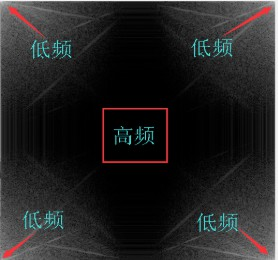

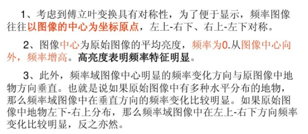


为了便于频域的滤波和频谱的分析，常常在变换之前进行频谱的中心化。根据频域平移性的性质有：
$$
   F(u-u_0,v-v_0)=f(x,y)e^{j2\pi(\frac{u_0x}{M}+\frac{v_0y}{N})}
$$

   当$u_0=\frac{M}{2},v_0=\frac{N}{2}$时，$e^{j2\pi(\frac{u_0x}{M}+\frac{v_0y}{N})}=(-1)^{x+y}$

从数学上说是在变换之前用指数项乘以原始函数，又因为$e^{j\pi}=1$，所以往往我们在写程序的时候实际上是把原始矩阵乘以$(-1)^{x+y}$**达到平移频域坐标原点至屏幕正中央的目的**。如下图所示：1<----->3 对调，2<----->4 对调，如matlab中的fftshit命令，可以将频域的坐标原点从显示屏起始点（0，0） 移至显示屏的中心点。

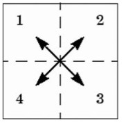


#### b) 频域滤波

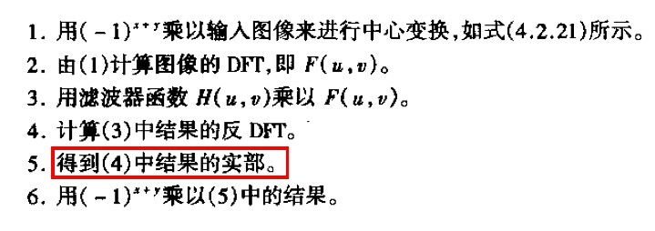

####  c) 理想低通滤波器（ILPF）

ILPF可以截断傅立叶变化中所有高频成分
$$
H(u,v)=\begin{cases}
   1 & D(u,v)\leq D_0 \\
   0 & D(u,v)>D_0\\
   \end{cases}，其中D(u,v) = \sqrt{u^2+v^2}
$$
以D0为半径的圆内所有频率分量无损的通过，圆外的所有频率分量完全衰减。**注意：傅立叶变换是酉变换，不改变信号能量**根据测不准原理，这时D0越小对应的空域模板越大，即空域卷积核越大，当D0趋近于0的时候，形成冲积函数，所有频率信息无损通过。


遇到的问题：

   1. 理想低通滤波器H(u)在频域是矩形，其空域滤波器核h(x)是sinc函数
   2. sinc会有正负震荡，导致出现振铃现象

原因：在截止频率D0附近对频谱过于“粗暴”的截断


#### d）改进后的Butterworth低通滤波器

n阶
$$
H(u,v) = \frac{1}{1+(\frac{\sqrt{u^2+v^2}}{D_0})^{2n}}
$$

n = 1阶，完全无振铃现象
$$
H(u,v) = \frac{1}{1+(\frac{u^2+v^2}{D_0})}
$$

1. 滤波器对（0，0）对称，对各方向的频率成分有相同效果。
2. 不同于ILPF，随着（u，v）增加，对频率成分是逐渐衰减，可有效抑制振铃现象。
3. 当n增加时，对频率成分趋于锐截断，振铃效果增强。

**模糊减少的原因在于：当和ILPF采用同样D0时，BLPF可以保留更多高频成分**


### 源码实现

详见pro1.m和butterworth_filter.m

```matlab
% butterworth_filter.m
function [res,f_res] = butterworth_filter(img,n,D0)
    [M,N] = size(img);
    f_res = zeros(M,N);
    % 对图像进行二维快速傅里叶变换
    F = fft2(img);
    % 频谱图像大小与空域图像相同
    for u = 1:M
        for v = 1:N
            % butterworth低通滤波器
            if D0 == 0 
                h = 0;
            else
                h = 1 / (1 + (sqrt(u^2+v^2)/D0)^(2*n));
            end
            % 与滤波函数相乘，等于空域卷积
            f_res(u,v) = F(u,v)*h;
        end
    end
    % DFT反变换取实部
    res = real(ifft2(f_res));
    % 频谱矩阵取对数
    f_res = log(1+abs(f_res));
    % 反中心变换
    [X,Y]=meshgrid(1:N,1:M);
    res = uint8(res.*(-1).^(X+Y));
end
```

```matlab
% pro1.m
clear 

barb_img = imread('../barb.png');

[M,N] = size(barb_img);

subplot(321),imshow(barb_img,[]),title('原图像f(x,y)')
% subplot(321),imshow(log(1+abs(fft2(barb_img))),[]),title('原频谱图像f(x,y)')

% 以(-1)^{(x+y)}乘以输入图像进行中心变换
[X,Y]=meshgrid(1:N,1:M);
% 类型转换
barb_img = double(barb_img);
barb_img = barb_img.*(-1).^(X+Y);

subplot(322),imshow(uint8(barb_img),[]),title('空域中心化调制图像')

[res_10,f_res10] = butterworth_filter(barb_img,1,10);
[res_20,f_res20] = butterworth_filter(barb_img,1,20);
[res_40,f_res40] = butterworth_filter(barb_img,1,40);
[res_80,f_res80] = butterworth_filter(barb_img,1,80);

subplot(323),imshow(res_10,[]),title('D0=10 butterworth filter低通滤波')
subplot(324),imshow(res_20,[]),title('D0=20 butterworth filter低通滤波')
subplot(325),imshow(res_40,[]),title('D0=40 butterworth filter低通滤波')
subplot(326),imshow(res_80,[]),title('D0=80 butterworth filter低通滤波')

% 显示频谱图像
% subplot(322),imshow(log(1+abs(fft2(barb_img))),[]),title('空域中心化调制后的频谱图像')
% subplot(323),imshow(f_res10,[]),title('D0=10 ')
% subplot(324),imshow(f_res20,[]),title('D0=20 ')
% subplot(325),imshow(f_res40,[]),title('D0=40 ')
% subplot(326),imshow(f_res80,[]),title('D0=80 ')
```


### 显示结果

#### 空域显示

根据滤波函数，D0越小，其保留的频率信息越少，且越低频的信息保留程度越大，在空域中则表现为卷积核的尺寸越大，丧失图片细节的部分，主要是低频信号。但它比同等D0下的理想低通滤波器保留的高频信息要多，且振铃现象在n较小的时候明显较少。随着D0的增加，图片的轮廓信息和一些细节逐渐显现，更多的高频信息被保留了下来。

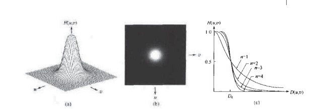

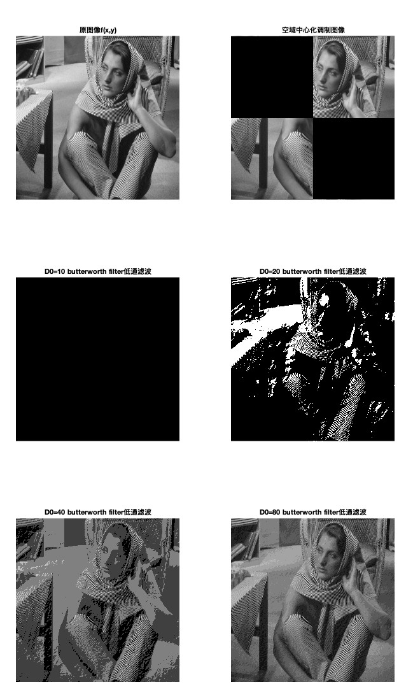


#### 频域显示

从频谱图像看到，当D0较小的时候，高频的信号被滤波器过滤掉，随着D0增加，中心周围的信号逐渐被保留。

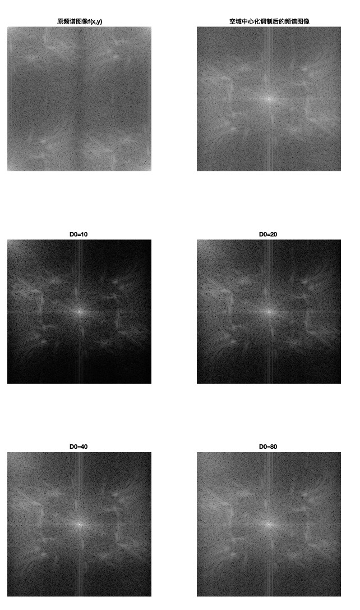


## 二、同态滤波

采用同态滤波来增强图像‘office.jpg’细节，**对数频域滤波器**为：
$$
H(u,v)=(\gamma_H-\gamma_L)[1-e^{-c[D^2(u,v)/D_0^2]}]+\gamma_L
$$
（1）参数选择：参考$\gamma_H=2,\gamma_L=0.25,C=1$

（2）自己尝试不同的 D0 以得到最好的结果。

（3）如将滤波器替换为一阶 Butterworth 高通滤波器，比较滤波结果。

提示：对于滤波输出图像，确定图像的最大和最小像素值 max 和 min ，得到 $range=max-min$，对于$f(x,y)$，以$255*(f(x,y)-min)/range$，得到最好的显示效果。


### 算法描述

#### a) 对数变换

对于一幅光照不均匀的图像f(x,y)，可以表示为照射分量i(x,y)和反射分量r(x,y)的乘积。0<i(x,y)<∞，0<r(x,y)<1。i(x,y)描述光强分量，变化缓慢，处于低频成分。r(x,y)描述景物反射到人眼中的图像，变化较快，处于高频成分。

因为该**性质是乘性的**，所以不能直接使用傅里叶变换对i(x,y)和r(x,y)进行控制，因此可以先对f(x,y)取对数，分离i(x,y)和r(x,y)。

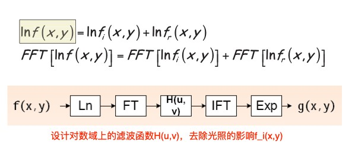


为了避免出现ln(0)的情况，采用ln ( f(x,y) + 1 ) 来计算。


#### b）滤波函数

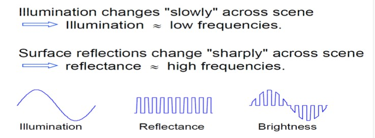

这种图像一般动态范围很大，但我们感兴趣的部分很暗，无法辨认细节的图像，为了减少光照的影响，增强图像的高频部分的细节，采用同态滤波来增强对比度，增强细节。是一种高斯高通滤波器的变形。
$$
H(u,v) = (\gamma_H-\gamma_L)[1-e^{-c(D^2(u,v)/D_0^2}]+\gamma_L
$$

1. 同态滤波用于解决乘性干扰
2. 滤波器H(u,v)的设计取决于信号f_i(x,y)的分布


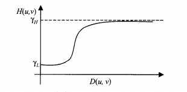

选择H > 1, L < 1可以达到衰减低频，增强高频的目的，常数c控制函数坡度的锐利度。D(u,v)和D0与之前低通滤波的时候意义一样。分别表示和频率中心的距离和截止频率。D0越大，对细节的增强越明显。

本次实验参考$\gamma_H=2,\gamma_L=0.25,C=1$

可以使用`imshow(I,[])` 显示灰度图像 `I`，根据 `I` 中的像素值范围对显示进行转换。`imshow` 使用 `[min(I(:)) max(I(:))]` 作为显示范围。`imshow` 将 `I` 中的最小值显示为黑色，将最大值显示为白色。

### 源码实现

```matlab
% homomorphic_filter.m
function [res,f_res] = homomorphic_filter(img,D0,H,L,C)
    % 转换为灰度图像
    img =double(rgb2gray(img));
    % 取对数
    img = log(1+img);

    [M,N] = size(img);

    % 中心变换
    [X,Y]=meshgrid(1:N,1:M);
    img = img.*(-1).^(X+Y);
    % 频谱矩阵
    f_res = zeros(M,N);
    % 傅立叶变换
    F = fft2(img);
    % 高通同态滤波
    for u = 1:M
        for v = 1:N
            d = u^2+v^2;
            h = (H-L).*(1-exp(-C.*(d./D0^2)))+L;
            f_res(u,v) = h*F(u,v);
        end
    end
    % 反傅立叶变换
    res = real(ifft2(f_res));
    % 反中心变换
    [X,Y] = meshgrid(1:N,1:M);
    res = res.*(-1).^(X+Y);
    % 取指数
    res = exp(res)-1;
    % 频谱矩阵
    f_res = log(1+abs(f_res));
 
    subplot(221),imshow(res,[]),title(['D0=',num2str(D0),' homomorphic filter高通图像'])
    subplot(222),imshow(f_res,[]),title(['D0=',num2str(D0),' homomorphic filter高通频谱'])
```

```matlab
% butterworth_high_filter.m
function [res,f_res] = butterworth_high_filter(img,n,D0)
    % 转换为灰度图像
    img =double(rgb2gray(img));
    % 中心变换
    [M,N] = size(img);
    [X,Y]=meshgrid(1:N,1:M);
    img = img.*(-1).^(X+Y);
    
    f_res = zeros(M,N);
    % 对图像进行二维快速傅里叶变换
    F = fft2(img);
    % 频谱图像大小与空域图像相同
    for u = 1:M
        for v = 1:N
            % butterworth低通滤波器
            if D0 == 0 
                h = 0;
            else
                h = 1 / (1 + (D0/sqrt(u^2+v^2))^(2*n));
            end
            % 与滤波函数相乘，等于空域卷积
            f_res(u,v) = F(u,v)*h;
        end
    end
    % DFT反变换取实部
    res = real(ifft2(f_res));
    % 频谱矩阵取对数
    f_res = log(1+abs(f_res));
    % 反中心变换
    [X,Y]=meshgrid(1:N,1:M);
    res = res.*(-1).^(X+Y);

    subplot(223),imshow(res,[]),title(['D0=',num2str(D0),' butterworth filter高通图像'])
    subplot(224),imshow(f_res,[]),title(['D0=',num2str(D0),' butterworth filter高通频谱'])
```

```matlab
% pro2.m
clear

office_img = imread('../office.jpg');

[r1,f1] = homomorphic_filter(office_img,500,2,0.25,1);
[r2,f2] = butterworth_high_filter(office_img,1,500);
```


### 显示结果

上面两张为同态滤波，下面两张为一阶 Butterworth 高通滤波器。

**D0 = 100**

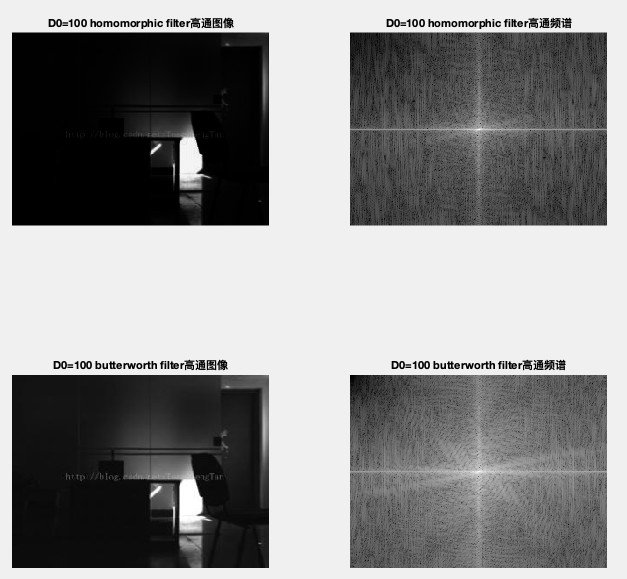

**D0 = 500**

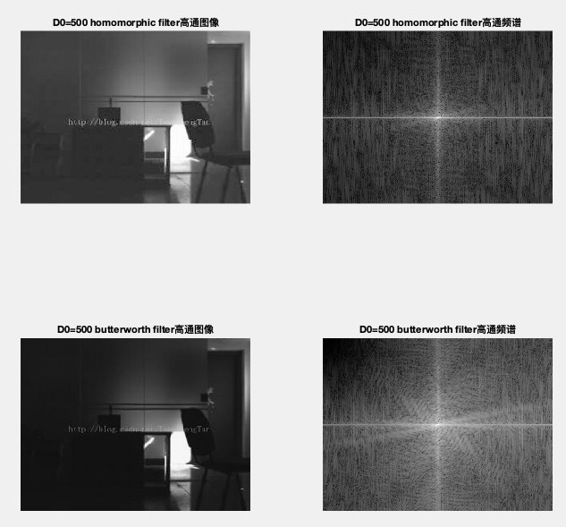

**D0 = 1000**

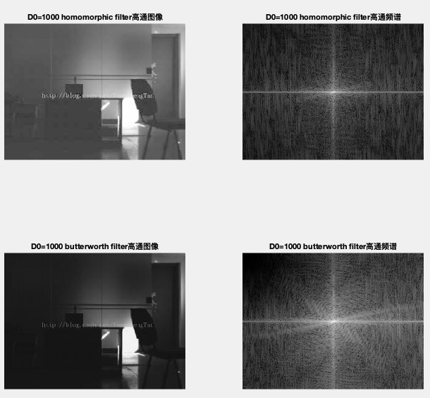

**D0 = 2000**

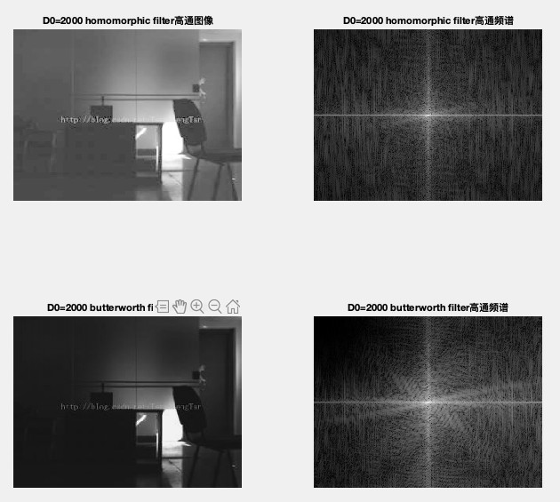

总体来说，由于同态滤波对输入图像进行对数变换，将乘性干扰转换为传统噪声模型进行处理，处理后的图像可以看到更多的细节，降低了照射分量的影响，而Butterworth 高通滤波器对这种图像的效果基本没有变化。

随着D0的增加，阴暗处的部分光照强度逐渐增加，且当D0等于1000的时候，可以看到很多的细节，且曝光度没有D0等于2000时那么明显，然而Butterworth 高通滤波器虽然过滤了更多的低频成分，但图片的处理效果不明显。