# Project 4：Image Restoration

1. Implement a blurring filter using the equation (5.6-11，数字图像处理（第三版）) in textbook, and blur the test image ‘book_cover.jpg’ using parameters a=b=0.1 and T=1. (20%)

2. Add Gaussian noise of 0 mean and variance of 500 to the blurred image. (10%)

3. Restore the blurred image and the blurred noisy image using the inverse filter. (30%)

4. Restore the blurred noisy image using the parametric Wiener filter with at least 3 different parameters, and compare and analyse results with that of 3. (40%)


## 算法描述

### 一、图像复原基本原理

图像复原是一个客观的过程，针对质量降低或失真的图像，试图恢复其原始的内容或质量。复原技术是面向退化模型的，并且采用相反的过程进行处理，以便恢复出原图像。在进行图像复原之前要先建立起其退化模型，根据该模型进行图像复原。

​							

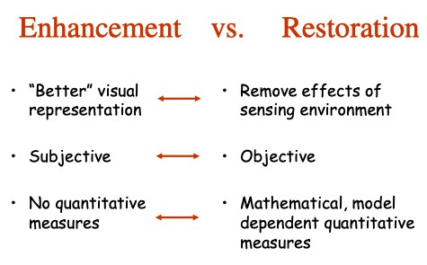

​									  图像复原和图像增强的比较

当退化仅为加性噪声时，空间处理非常适用，通过对一些噪声模型（例如高斯噪声，瑞利噪声，椒盐噪声等等）的噪声参数估计，选择合适的空间滤波器（如均值滤波器，中值滤波器），或者频率滤波器（带阻/带通滤波器，低通/高通滤波器，陷波滤波器）进行**图像去噪**处理。

当退化模型较为复杂时，如非线性的运动模糊和大气湍流模型，通过先验或估计的方法得到图像退化模型H
由H，通过逆过程H^(-1)恢复图像。


教材中的退化模型被建模为一个退化函数和一个加性噪声。

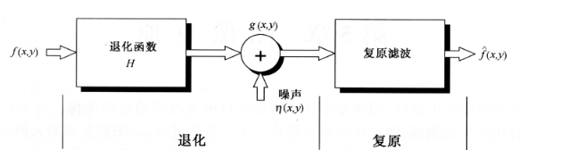


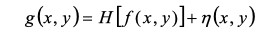

引起图像退化的原因常常为非线性的，非线性以及与位置 相关的退化处理技术，虽然可得到更加精确的结果，但在 处理上将会非常困难并常常可能无解，对许多**退化过程用线性系统近似**不但可以方便求解，而且可得到基本满意的结果，**从线性系统角度，图像的退化可看作为原始图像与退化函数的卷积**，因此线性**图像复原往往称之为“图像去卷积”， 所采用的滤波器称之为“去卷积滤波器”**。

根据上图，假设H是一个线性时不变的过程，可以得到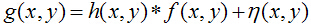，式子中的“*”表示卷积。其频率域的表示为：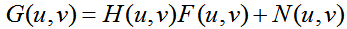

所以有效地获得退化系统H 和噪声η的模型， 是成功进行图像复原的关键。图像复原是一个求逆（反演）问题，逆问题经 常存在非唯一解，甚至无解。为了得到逆问题的有用解， 需要有先验知识以及对解的附加约束条件——正则化约束。

总体过程（频域处理）

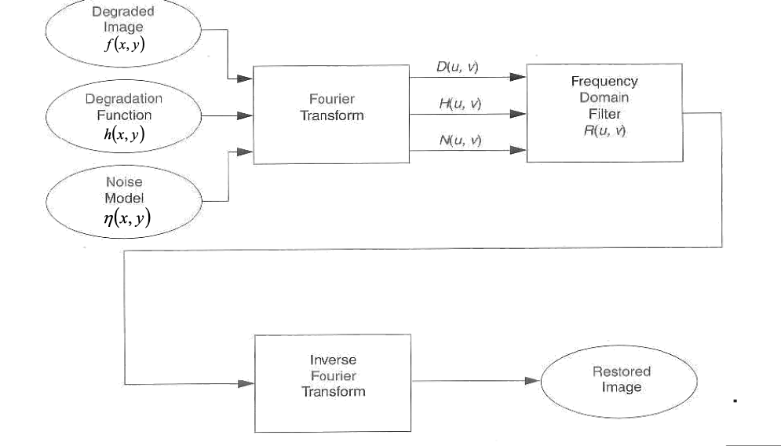


### 二、噪声模型

题目中要求加入的噪声为高斯噪声，其概率密度函数为：

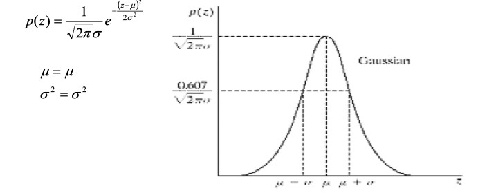

在空域中添加,注意使用imnoise需要**对方差进行归一化处理**

> J = imnoise(I,type,parameters) Depending on type, you can specify additional parameters to imnoise. All numerical parameters are normalized— they correspond to operations with images with intensities ranging from 0 to 1.
>

```matlab
m = 0;
v = 500;
variance=v/255^2;
noise=imnoise(zeros(m,n),'gaussian',m,variance);
img = img + noise;
```

在频域中添加

```matlab
% 生成均值为m和方差为n的高斯噪声的傅里叶变换
noise = m + sqrt(n) * randn([M, N]);
Fn = fftshift(fft2(noise));
F = fftshift(fft2(img));
F = F + Fn;
```


### 三、运动模糊退化模型

针对对退化函数H(u,v)的估计，常称为“系统辨识过程”，是进行系统退化复原的关键一步，常见有以下三种方法：

1. 观察法
2. 实验法
3. 数学建模法


观察法：

通过选择噪声较小的子图像（减少噪声的影响）来得到H(u,v)，然后根据此信息来构建全图的H(u,v)，之后利用后面的复原方法来复原。

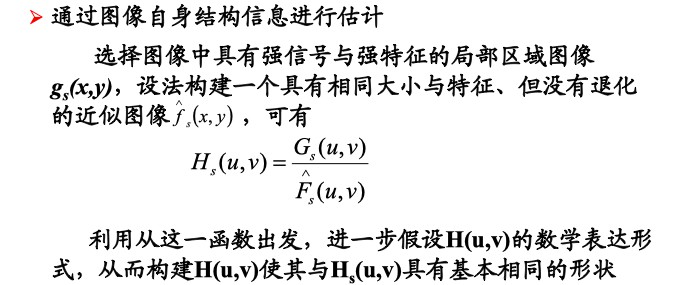

实验法：

使用或设计一个与图像退化过程相似的装置（过程），使其成像一个脉冲，可得到退化系统的冲激响应 H(u,v) = G(u,v) / A。

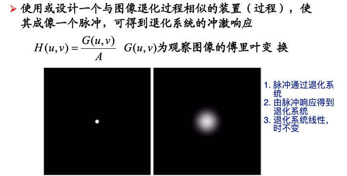


数学建模法（本次实验用到）：

从引起图像退化的基本原理进行推导，进而对原始图像进行模拟，在模拟过程中调整模型参数以获得尽可能精确的 退化模型。课本中有大气湍流和运动模糊模型。

教材（5.6-11）

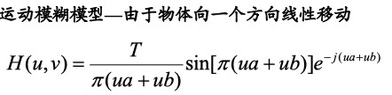

其中T表示曝光时间，a和b分别表示水平和垂直方向上的移动量。因为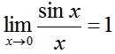，当π(ua+vb) = 0时，H(u,v) = T。

```matlab
% 生成运动模糊的傅里叶变换，即频域退化函数，频率中心在(p,q)
a = 0.1;
b = 0.1;
T = 1;
H = zeros(M, N);

for u = 1 : M
    for v = 1 : N
        d = pi * ((u-p)*a + (v-q)*b);
        if (d == 0)
            H(u,v) = T;
        else
            H(u,v) =  T * sin(d) / d * exp(-1i * (d));
        end
    end
end

% 频谱图像
imshow(log(abs(H) + 1), [])
% 生成运动模糊图像
F = fftshift(fft2(img));
MotionBlurred_f = F .* H;
MotionBlurred = real(ifft2(MotionBlurred_f));
```

其频谱图像为：

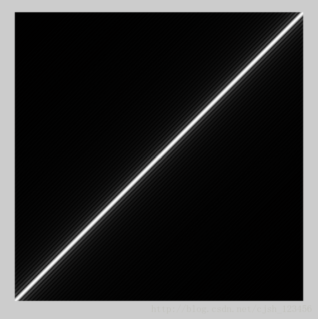


### 四、逆滤波

实验证明，当退化图像的噪声较小，即轻度降质时，即加性噪声n（x，y）很小时，采用逆滤波复原的方法可以获得较好的结果。

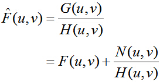

当加性噪声n（x，y）很小时，后一项趋紧于0。

```matlab
% 对运动模糊图像进行逆滤波
MotionBlurred_Inverse_f =  MotionBlurred_temp_f ./ H;
MotionBlurred_Inverse = real(ifft2(MotionBlurred_Inverse_f));

% 对模糊加噪声图像进行逆滤波
BlurredNoisy_Inverse_f = BlurredNoisy_temp_f ./ H;
BlurredNoisy_Inverse = real(ifft2(BlurredNoisy_Inverse_f));
```

其中存在病态问题：

即使N(u,v)很小或者为0，当H(u,v)接近0的时候，N(u,v)/H(u,v)会变得很大，噪声影响大大增强。

改进方法：

1. 对G(u,v)/H(u,v)应用一个低通滤波器，虑去其中病态的高频成分（即虑去H(u,v)中接近0的部分）

2. 规定一个门限值，当|H(u,v)| ≤ δ 时，1/H(u,v) = 0。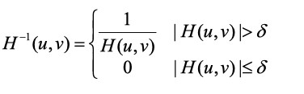


低通滤波器的方法对于上面提到的运动模糊模型几乎没有用，因为根据频谱图像，运动模糊模型的傅里叶频谱并不是从中间向四周赋值逐渐减小的。


### 五、维纳滤波（最小均方误差滤波）

假定图像f(x,y)和噪声η均为随机信号，且相互之间互不相关。设计一个目标函数，寻找其最小值。

课件给了两种选择：

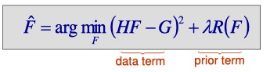

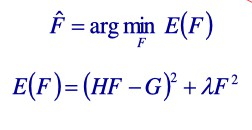

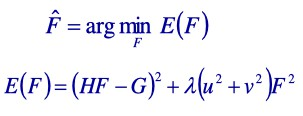


都是通过寻找均方误差，其中data term为最佳复原图像和原图像的误差，prior term不同，都是为了抑制较大的F值，使得当频率(u,v)较大时，F较小。

求解分别得到：

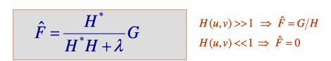

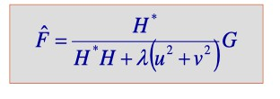

如果使用的是第二种形式，其中$\lambda$较第一种格式取值更小，小大约4到5个数量级，$\lambda$与噪声和未退化图像之间的信噪比有关。

```matlab
lambda = 0.000005;
% 生成维纳滤波的傅里叶变换
for u = 1 : M
    for v = 1 : N
       Wiener(u,v) = (abs(H(u,v)).^2) ./ (abs(H(u,v)).^2 + lambda*((u-p)^2+(v-q)^2)) ./ H(u,v);
    end
end

% 对运动模糊图像进行维纳滤波
MotionBlurred_Wiener_f =  MotionBlurred_temp_f .* Wiener;
MotionBlurred_Wiener = real(ifft2(MotionBlurred_Wiener_f));

% 对模糊加噪声图像进行逆滤波
BlurredNoisy_Inverse_f = BlurredNoisy_temp_f ./ H;
BlurredNoisy_Inverse = real(ifft2(BlurredNoisy_Inverse_f));
```

或者第一种形式，$\lambda$大约在0.01左右效果较好。

```matlab
Wiener = (abs(H).^2) ./ (abs(H).^2 + lambda) ./ H;
```


维纳滤波为均方误差最小意义下的最佳滤波，可使具有噪声干扰图像的客观复原性能达到最佳，维纳滤波器假定图像与噪声均为平稳随机过程，若图像与噪声实际随机特性平稳性差距较大时，维纳滤波器难以得到最佳结果

维纳滤波器建立在最小化统计准则基础上（贝叶斯定理），只是在平均意义上最优维纳滤波需大量先验知识，实用中常常难以进行 ，尤其是噪声功率谱、未退化图像的功率谱很难获取通过在滤波过程中调节K值以得到准最佳结果 ，进一步假设噪声为零，K=0，维纳滤波器退化为逆滤波器。


## 代码实现

```matlab
clear all;

img = imread('../book_cover.jpg');
[M, N] = size(img);

% 参数如下：
% p,q为频率中心，
% m,n 分别为高斯噪声的均值和方差
% a,b,T为运动模糊参数，
% lambda为维纳滤波参数
p = M / 2 + 1.0;
q = N / 2 + 1.0;
m = 0;
n = 500;
a = 0.1;
b = 0.1;
T = 1;
lambda = 0.05;

% 读取图像
img = double(img);

% 中心变换
[X,Y]=meshgrid(1:N,1:M);
img = img.*(-1).^(X+Y);

% 对原图像进行傅里叶变换
F = fft2(img);

% 生成运动模糊的傅里叶变换，即退化函数，频率中心在(p,q)
H = zeros(M, N);
for u = 1 : M
    for v = 1 : N
        d = pi * ((u-p)*a + (v-q)*b);
        if (d == 0)
            H(u,v) = T;
        else
            H(u,v) =  T * sin(d) / d * exp(-1i * (d));
        end
    end
end

% 生成均值为m和方差为n的高斯噪声的傅里叶变换
noise = m + sqrt(n) * randn([M, N]);
Fn = fftshift(fft2(noise));

% 生成维纳滤波的傅里叶变换
for u = 1 : M
    for v = 1 : N
       % 第一种公式
       Wiener(u,v) = (abs(H(u,v)).^2) ./ (abs(H(u,v)).^2 + lambda) ./ H(u,v);  
       % 第二种公式
       % Wiener(u,v) = (abs(H(u,v)).^2) ./ (abs(H(u,v)).^2 + lambda*((u-p)^2+(v-q)^2)) ./ H(u,v);
    end
end

% 生成运动模糊图像
MotionBlurred_f = F .* H;
MotionBlurred = real(ifft2(MotionBlurred_f));
% 反中心变换
[X,Y] = meshgrid(1:N,1:M);
MotionBlurred = MotionBlurred.*(-1).^(X+Y);
subplot(231),imshow(MotionBlurred,[]),title('运动模糊图像');

% 生成运动模糊图像，加上高斯噪声
BlurredNoisy_f = F .* H + Fn;
BlurredNoisy = real(ifft2(BlurredNoisy_f));
% 反中心变换
[X,Y] = meshgrid(1:N,1:M);
BlurredNoisy = BlurredNoisy.*(-1).^(X+Y);
subplot(232),imshow(BlurredNoisy,[]),title('运动模糊加噪图像');

% 获得模糊图像的频域信息
MotionBlurred_temp = MotionBlurred;
% 中心变换
[X,Y]=meshgrid(1:N,1:M);
MotionBlurred_temp = MotionBlurred_temp.*(-1).^(X+Y);
% 对运动模糊图像进行傅里叶变换
MotionBlurred_temp_f = fft2(MotionBlurred_temp);

% 对运动模糊图像进行逆滤波
MotionBlurred_Inverse_f =  MotionBlurred_temp_f ./ H;
MotionBlurred_Inverse = real(ifft2(MotionBlurred_Inverse_f));
% 反中心变换
[X,Y] = meshgrid(1:N,1:M);
MotionBlurred_Inverse = MotionBlurred_Inverse.*(-1).^(X+Y);
subplot(233),imshow(MotionBlurred_Inverse,[]),title('运动模糊图像进行逆滤波');

% 对运动模糊图像进行维纳滤波
MotionBlurred_Wiener_f =  MotionBlurred_temp_f .* Wiener;
MotionBlurred_Wiener = real(ifft2(MotionBlurred_Wiener_f));
% 反中心变换
[X,Y] = meshgrid(1:N,1:M);
MotionBlurred_Wiener = MotionBlurred_Wiener.*(-1).^(X+Y);
subplot(234),imshow(MotionBlurred_Wiener,[]),title('运动模糊图像进行维纳滤波');

% 获得模糊加噪图像的频域信息
BlurredNoisy_temp = BlurredNoisy;
% 中心变换
[X,Y]=meshgrid(1:N,1:M);
BlurredNoisy_temp = BlurredNoisy_temp.*(-1).^(X+Y);
% 对运动模糊图像进行傅里叶变换
BlurredNoisy_temp_f = fft2(BlurredNoisy_temp);

% 对模糊加噪声图像进行逆滤波
BlurredNoisy_Inverse_f = BlurredNoisy_temp_f ./ H;
BlurredNoisy_Inverse = real(ifft2(BlurredNoisy_Inverse_f));
% 反中心变换
[X,Y] = meshgrid(1:N,1:M);
BlurredNoisy_Inverse = BlurredNoisy_Inverse.*(-1).^(X+Y);
subplot(235),imshow(BlurredNoisy_Inverse,[]),title('模糊加噪图像进行逆滤波');

% 对模糊加噪图像进行维纳滤波
BlurredNoisy_Wiener_f = BlurredNoisy_temp_f .* Wiener;
BlurredNoisy_Wiener = real(ifft2(BlurredNoisy_Wiener_f));
% 反中心变换
[X,Y] = meshgrid(1:N,1:M);
BlurredNoisy_Wiener = BlurredNoisy_Wiener.*(-1).^(X+Y);
subplot(236),imshow(BlurredNoisy_Wiener,[]),title('模糊加噪图像进行维纳滤波');
```


## 实验结果

### 一、运动模糊图像（a=0.1,b=0.1,T=1)

### 二、加入高斯噪声后的模糊图像

### 三、使用逆滤波器复原的两张图像

### 四、使用不同参数的维纳滤波器复原的两张图像


