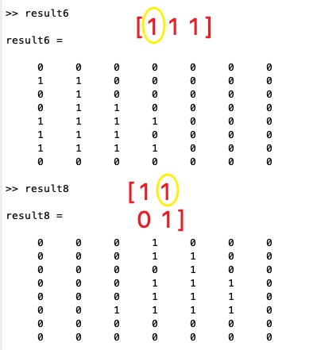

# Project 5 形态学与图像分割

## 第一题


### 算法描述

形态学处理：

- 邻域运算
- 特殊定义的邻域称之为 “ 结构单元 ” （ Structure Element）， 它以中心点对准待处理像素，逐点扫描像素，在每个像素位置上它与二值图像对应的区域进⾏特定的逻辑运算，逻辑运算的结果为输出图像的相应像素。


基本处理定义：

1. 膨胀（dilation），A用B结构单元扩张记作 A ⊕ B
   - 结构单元以中心点对准待处理像素，逐点扫描像素
   - 如果模板中有一个或以上的1点与其对应的像素点相同，待处理像素为1,否则为0
2. 腐蚀（erosion），A用B结构单元腐蚀为 A Θ B
   - 结构单元以中心点对准待处理像素，逐点扫描像素
   - 如果模板中所有1点与其对应像素相同，则待处理像素为1，否则为0
3. 结构开（open）变换，定义： A o B = ( A Θ B ) ⊕ B（先腐蚀然后再扩张）
4. 结构闭（close）变换，定义： A • B = ( A ⊕ B ) Θ B（先扩张再腐蚀）


### 代码及运行结果

a）

根据结构单元和原点位置，需要在原图像矩阵右侧padding两列，假设黑色代表0，循环将结构单元原点对准对每个像素点，由于结构单元中每个元素都为1，只要有一个1和原图像中的对应点相同，此像素点就为1，否则为0。

```matlab
binary_array = [
    0,0,0,0,0,0,0;
    0,0,1,1,0,0,0;
    0,0,0,1,0,0,0;
    0,0,0,1,1,0,0;
    0,0,1,1,1,1,0;
    0,0,1,1,1,0,0;
    0,1,0,1,0,1,0;
    0,0,0,0,0,0,0;
];
origin =  0;
[m,n] = size(binary_array);
padding1 = [binary_array,zeros(m,2)];

result1 = zeros(m,n);
for x = 1:m
    for y = 1:n
        if Structure_Element1(1,1) == padding1(x,y) || Structure_Element1(1,2) == padding1(x,y+1) || Structure_Element1(1,3) == padding1(x,y+2)
            result1(x,y) = 1;
        end
    end
end
```


b)

同样的结构单元和原点，循环将结构单元原点对准对每个像素点，由于结构单元中每个元素都为1，所有的1和原图像中的对应点相同，此像素点就为1，否则为0。

```matlab
result2 = zeros(m,n);
for x = 1:m
    for y = 1:n 
        if Structure_Element1 == padding1(x,y:y+2)
            result2(x,y) = 1;
        end
    end
end
```


c）

重新进行zero-padding，并改变结构单元和原点位置。

```matlab
origin = (1,2);
Structure_Element2 = [1,1 ; 0,1];
padding2 = [zeros(m,1),binary_array;zeros(1,n+1)];

result3 = zeros(m,n);
for x = 1:m
    for y = 1:n 
        if Structure_Element2(1,1) == padding2(x,y) || Structure_Element2(1,2) == padding2(x,y+1) || Structure_Element2(2,2) == padding2(x+1,y+1)
            result3(x,y) = 1;
        end
    end
end
```


d)

```matlab
result4 = zeros(m,n);
for x = 1:m
    for y = 1:n 
        if Structure_Element2(1,1) == padding2(x,y) && Structure_Element2(1,2) == padding2(x,y+1) && Structure_Element2(2,2) == padding2(x+1,y+1)
            result4(x,y) = 1;
        end
    end
end
```


e)

对于第一个结构单元，将b的结果padding后进行a中的膨胀

对于第二个结构单元，将d的结果padding后进行c中的膨胀

```matlab
result5 = zeros(m,n);
padding3 = [result2,zeros(m,2)];
for x = 1:m
    for y = 1:n
        if Structure_Element1(1,1) == padding3(x,y) || Structure_Element1(1,2) == padding3(x,y+1) || Structure_Element1(1,3) == padding3(x,y+2)
            result5(x,y) = 1;
        end
    end
end

result7 = zeros(m,n);
padding5 = [zeros(m,1),result4;zeros(1,n+1)];
for x = 1:m
    for y = 1:n
        if Structure_Element2(1,1) == padding5(x,y) || Structure_Element2(1,2) == padding5(x,y+1) || Structure_Element2(2,2) == padding5(x+1,y+1)
            result7(x,y) = 1;
        end
    end
end
```


f)

对于第一个结构单元，将a的结果padding后进行b中的腐蚀

对于第二个结构单元，将c的结果padding后进行d中的腐蚀

```matlab
result6 = zeros(m,n);
padding4 = [result1,zeros(m,2)];
for x = 1:m
    for y = 1:n 
        if Structure_Element1 == padding4(x,y:y+2)
            result6(x,y) = 1;
        end
    end
end

result8 = zeros(m,n);
padding6 = [zeros(m,1),result3;zeros(1,n+1)];
for x = 1:m
    for y = 1:n
        if Structure_Element2(1,1) == padding6(x,y) && Structure_Element2(1,2) == padding6(x,y+1) && Structure_Element2(2,2) == padding6(x+1,y+1)
            result8(x,y) = 1;
        end
    end
end
```




在处理二值图像的效果上：

- 膨胀使图像扩⼤（结构单元越大，效果越强）
- 腐蚀使图像缩⼩（结构单元越大，效果越强）
- 开变换使轮廓平滑，抑制 A 物体边界的小离散点或尖峰，在研究物体的形态分布时常用。⽤来消除小物体、在纤细点处分离物体、平滑较大物体的边界的同时并不明显改变其面积。
- 闭变换也是⽤于图像光滑。但与开变换相反，闭变换⽤来填充物体内细小空洞、连接邻近物体、平滑其边界的同时并不明显改变其面积。


## 第二题


### 算法描述

基于全局阈值的图像分割：

阈值法的基本思想是基于图像的灰度特征来计算一个或多个灰度阈值，并将图像中每个像素的灰度值与阈值相比较，最后将像素根据比较结果分到合适的类别中。因此，该类方法最为关键的一步就是按照某个准则函数来求解最佳灰度阈值。


计算全局阈值的算法

1. 选择一个T的初始估计值（一般为平均灰度）
2. 用T分割图像，生成两组像素：G1 由所有灰度值大于T的像素组成，而G2 由所有灰度值小于或等于T的像素组成
3. 对区域G1 和 G2 中的所有像素计算平均灰度值µ1 和 µ2
4. 计算新的阈值 $T=\frac{1}{2}(µ_1+µ_2)$
5. 重复步骤2到4，直到逐次迭代所得的T值之差小于事先定义的参数T0（0.5）


第二幅图片的光照不均匀，其灰度图并不是呈现出双峰的密度分布，故类似之前的同态滤波，首先对图像进行增强，改善直方图分布，然后运用全局阈值方法分割图像。


目标：估计fi(x,y)的光照模型函数并去除光照后的影响然后进行图像分割。

$f_r(x,y)=\frac{f(x,y)}{f_i(x,y)}$


1. 首先取对数，将乘性干扰转换为加性干扰

   $z(x, y) = ln f(x, y)= ln f_r(x, y) + ln f_i(x, y) = r_l (x, y) + i_l (x, y)​$

   

2. 根据下图，光照函数一般是缓慢变化的低频部分，估计光照函数为
   $i_l (x, y) = a_0 + a_x + a_2y + a_3xy$


3. 最小化均方误差

   $e(x, y) = z(x, y) − i_l (x, y) = z(x, y) − (a_0 + a_1 x + a_2 y + a_3 xy)$

   

   

   

   

   

4. 根据系数a得到光照函数$i_l(x,y)$，并根据$r_l (x, y) = z(x, y) -  i_l (x, y)$得到最终增强后的图像。


然后使用同第一张图片一样的算法寻找全局阈值并进行二值分割。


### 代码

第一张图

```matlab
% pro2.m

clear;

img1=imread('blobz1.png');

[m,n]=size(img1);

count=0;
T=mean2(img1);
flag=false;
while ~flag
    count = count+1;
    g = img1>T;
    T_next = 0.5*(mean(img1(g))+mean(img1(~g)));
    flag = abs(T-T_next)<0.5;
    T = T_next;
end

% 将灰度图像转换成二值图像
g=im2bw(img1,T/255);
figure;subplot(2,2,1);imshow(img1);title('原图像');
subplot(2,2,2);imhist(img1);title('直方图');
subplot(2,2,3);imshow(g);title('切割后图像');
```

第二张图

```matlab
% pro22.m
clear;

img2 = imread('blobz2.png');

img2 =double(img2);
[M,N] = size(img2);
[X,Y]=meshgrid(1:N,1:M);

mx=mean2(X);
my=mean2(Y);
mxy=mean2(X.*Y);
mx2=mean2(X.^2);
my2=mean2(Y.^2);
mx2y=mean2(X.^2.*Y);
mxy2=mean2(X.*Y.^2);
mx2y2=mean2(X.^2.*Y.^2);
C=[1,mx,my,mxy;mx,mx2,mxy,mx2y;my,mxy,my2,mxy2;mxy,mx2y,mxy2,mx2y2];
CI=inv(C);

mL=mean2(img2);
mLx=mean2(img2.*X);
mLy=mean2(img2.*Y);
mLxy=mean2(img2.*X.*Y);
v=[mL,mLx,mLy,mLxy]';
aL=CI*v;

% 光照函数
GL=aL(1)+aL(2).*X+aL(3).*Y+aL(4).*X.*Y;
% 去除光照影响
RL=img2-GL;

ymax=255;ymin=0;
xmax = max(max(RL)); %求得RL中的最大值
xmin = min(min(RL)); %求得RL中的最小值
OutImg = uint8(round((ymax-ymin)*(RL-xmin)/(xmax-xmin) + ymin)); %归一化并取整

% 全局阈值计算
count=0;
T=mean2(OutImg);
flag=false;
while ~flag
    count=count+1;
    g=OutImg>T;
    Tnext=0.5*(mean(OutImg(g))+mean(OutImg(~g)));
    flag=abs(T-Tnext)<0.5;
    T=Tnext;
end
img2 = uint8(img2);
% 转换为二值图像
g=im2bw(OutImg,T/255);
figure;subplot(3,2,1);imshow(img2);title('原图像');
subplot(3,2,2);imhist(img2);title('原直方图');
subplot(3,2,3);imshow(OutImg);title('增强后图像');
subplot(3,2,4);imhist(OutImg);title('增强后直方图');
subplot(3,2,5);imshow(g);title('切割后图像');
```


### 运行结果

第一张图分割结果


迭代得到的全局阈值为 130.5068。


第二张图分割结果，改善后的直方图分布形状易于寻找全局阈值进行分割。


迭代得到的全局阈值为 136.1927。


**保存结果见blobz1_seg.jpg和blobz2_seg.jpg**


结果对比，第一张图片的分割效果要好于第二张图片，原因在于其直方图分布的双峰形状要好于第二张图增强后的直方图形状，即当各个波峰很高、很窄、相对对称，且被很深的波谷分开时，通过算法可以有效得到最佳全局的阈值，出错概率低。

另一种方法是将第二张图像进一步细分为子图像，并对不同的子图像使用不同的阈值处理，通过自适应阈值的方法进行子图像的分割。或者通过只把区域边缘的像素绘入直方图，而不考虑区域中间的像素来改善直方图的波峰形状。


但是如果手动将阈值T设为150，发现第二张图片的分割效果要好于自动进行迭代计算的结果。见blobz2_seg_150.jpg


参考：

https://www.cis.rit.edu/class/simg782/lectures/lecture_06/doc/lec782_05_06_combined.pdf