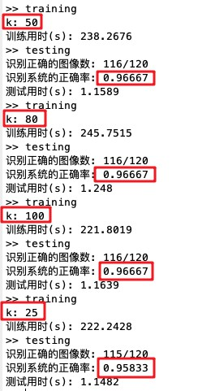

# 基于PCA的人脸识别

## 算法描述

### 利用 PCA 生成训练集的 Eigenface

> **Principal components analysis** 主成分分析，是一种分析、简化数据集的技术。用于减少数据集的维数，同时保持数据集中的对方差贡献最大的特征。


**算法步骤**

1、初始化一个训练集矩阵，每一行为不同训练数据在同一个维度的不同坐标，每一列代表一个训练数据。

​	在剑桥大学ORL人脸数据库中，随机选取每个人（共40个人）中的7张不同人脸（共10张）的平均图像作为训练数据，每张图像的像素点数目（98 x 115）为初始维数，形成初始矩阵 *B* （10,304 x 40）


2、进行零均值处理

​	$B=B-E(B)​$，其中 *E(B)* 为所有训练数据的均值，这一步减少了数据分布的分散性，有利用投影空间的构造效果。


3、求取协方差矩阵

​	要生成投影子空间，需要一组正交的基向量，所以构造协方差矩阵 *C*（10,304 x 10,304），利用其对称性获得的特征向量都是正交的。
$$
C=\frac{1}{n-1}BB^*，n为40
$$


4、求取协方差矩阵的特征值与特征向量

​	由奇异值分解（singular value decomposition）定理可知，对称矩阵可以分解成同一组特征向量来表示，一个特征向量对应一个特征值，特征值越大，表明该特征向量占有的信息量越大，其越适合作为投影子空间的基向量。故将特征值降序排列，并根据对应的特征向量选择前 *k* 个作为基向量构成投影子空间 *V* （10,304 x k）即为特征脸，这一步也可以消除线性相关的向量之间的冗余性。

​	

5、将原始矩阵投射到该子空间得到降维矩阵 *E* （k x 40）
$$
E = V^*B
$$
6、将得到的 *E(B)* ， *V* 和 *E* 保存

### 

### 二范数最小匹配

> 对每个人剩余的三张图片作为测试集进行匹配


**算法步骤**

1、将测试图片转换为向量（10,304 x 1），并利用上一步保存的 *E(B)* 的进行零均值处理

2、利用 *V* 进行降维投影，得到 k 个系数（k x 1）

3、与 *E* 中每一列计算二范数（即欧式距离），并得到最小值的下标即为匹配的类别

4、如果匹配的类别和测试图片所属的类别相同，更新正确数量

5、得到正确率 =（识别正确的图像数）/ 120。


## 代码

```matlab
% training.m
clear;

Img_Mat = [];
row = 112;
col = 92;
d = row*col;
k = 100;

tic;
for x = 1:40 
     % 每个目录随机选取7个作为训练样本，剩余3个作为测试样本
     idx = randperm(10);
     training_set(x,:) = idx(1:7);
     testing_set(x,:) = idx(8:10);
     % temp_set d*7
     temp_set = [];
     for y = training_set(x,:)
          temp_mat = imread(['../att_faces/s',num2str(x),'/',num2str(y),'.pgm']);   
          temp_mat = reshape(temp_mat,[d,1]); %将图片转化为一个列向量
          temp_set = [temp_set temp_mat];
     end
     % Img_Mat d*40
     Img_Mat = [Img_Mat mean(temp_set,2)];
end

% differ_mat d*N
differ_mat = [];
img_mean = mean(Img_Mat,2);
% 40张平均图像
num_img = size(Img_Mat,2);

for i = 1:num_img
     temp_mat = double(Img_Mat(:,i)) - img_mean;
     differ_mat = [differ_mat temp_mat];
end

% C_mat d*d
C_mat = (1/(num_img-1)).*(differ_mat * differ_mat');
[eiv eic] = eig(C_mat);   %求取特征向量eiv以及特征值eic

% 降序排列特征值
[dd,ind] = sort(diag(eic),'descend');
eic_sort = eic(ind,ind);
eiv_sort = eiv(:,ind);
% Vk_mat d*k
Vk_mat = eiv_sort(:,1:k);

% Ei_Face k*N
Ei_Face = Vk_mat' * differ_mat ;     %得到协方差矩阵的特征向量组成的投影子空间

% project_sample d*N
% project_sample = [];
% project_sample = Vk_mat * Ei_Face;
t1 = toc;
disp(['训练用时(s): ',num2str(t1)]);
save training.mat img_mean Vk_mat Ei_Face testing_set d
```


```matlab
% testing.m
clear;
load training.mat;

tic;
% 记录识别正确数
correct_num = 0;
for x = 1:40
    for y = testing_set(x,:)
        temp_mat = imread(['../att_faces/s',num2str(x),'/',num2str(y),'.pgm']);   
        % 显示测试图像
        % figure,
        % subplot(1,2,1),imshow(temp_mat);
        % title('Test Image');

        %************投影降维度测试图片***************************
        temp_mat = reshape(temp_mat,d,1);
        temp_mat = double(temp_mat) - img_mean;
        project_test = [];
        % project_test k*1
        project_test = Vk_mat' * temp_mat;

        %****************计算二范数*****************************
        com_dist = [];
        % Ei_Face k*40
        % i = 1:40
        for i = 1:size(Ei_Face,2)
            vec_dist = norm(project_test - Ei_Face(:,i),2);
            com_dist = [com_dist vec_dist];
        end
        %************筛选出距离最小的样本图片*********************
        [match_min,match_index] = min(com_dist);
        if match_index == x
            correct_num = correct_num+1;
        end

        % 显示识别图像，用于全局训练
        % directories = ceil(match_index / 10);
        % subject = mod(match_index,10);
        % if subject == 0
        %     subject = 10;
        % end
        % recognize_img = imread(['../att_faces/s',num2str(directories),'/',num2str(subject),'.pgm']);   
        % subplot(1,2,2),imshow(recognize_img);
        % title('Recognized Image');
    end
end
t1 = toc;
disp(['识别正确的图像数: ',num2str(correct_num),'/120']);
disp(['识别系统的正确率: ',num2str(correct_num/120)]);
disp(['测试用时(s): ',num2str(t1)]);
```


```matlab
% training_imp.m
clear;

Img_Mat = [];
row = 112;
col = 92;
d = row*col;
k = 25;

tic;
for x = 1:40 
     % 每个目录随机选取7个作为训练样本，剩余3个作为测试样本
     idx = randperm(10);
     training_set(x,:) = idx(1:7);
     testing_set(x,:) = idx(8:10);
     % temp_set d*7
     temp_set = [];
     for y = training_set(x,:)
          temp_mat = imread(['../att_faces/s',num2str(x),'/',num2str(y),'.pgm']);   
          temp_mat = reshape(temp_mat,[d,1]); %将图片转化为一个列向量
          temp_set = [temp_set temp_mat];
     end
     % Img_Mat d*40
     Img_Mat = [Img_Mat mean(temp_set,2)];
end

% display the mean image
for x = 1:5
    for y = 1:8
        temp_mat = Img_Mat(:,(x-1)*8+y);
        temp_mat = reshape(temp_mat,[row col]);
        subplot(5,8,(x-1)*8+y),imshow(temp_mat,[]);
    end
end

% differ_mat d*N
differ_mat = [];
img_mean = mean(Img_Mat,2);
% 40张平均图像
num_img = size(Img_Mat,2);

for i = 1:num_img
     temp_mat = double(Img_Mat(:,i)) - img_mean;
     differ_mat = [differ_mat temp_mat];
end

% C_mat N*N
C_mat = differ_mat' * differ_mat;
[eiv eic] = eig(C_mat);   %求取特征向量eiv以及特征值eic

% 降序排列特征值
[dd,ind] = sort(diag(eic),'descend');
eic_sort = eic(ind,ind);
eiv_sort = eiv(:,ind);
% Wk_mat N*k
Wk_mat = eiv_sort(:,1:k);

% Vk_mat d*k
Vk_mat = differ_mat * Wk_mat;

% normalize columns of Vk_mat
Vk_mat = normc(Vk_mat);

% Ei_Face k*N
Ei_Face = Vk_mat' * differ_mat ;     %得到协方差矩阵的特征向量组成的投影子空间

% display the Eigenface
figure
for x = 1:k
    temp_mat = Vk_mat(:,x);
    temp_mat = reshape(temp_mat,[row col]);
    subplot(5,5,x),imshow(temp_mat,[]);
end

% project_sample d*N
% project_sample = [];
% project_sample = Vk_mat * Ei_Face;
t1 = toc;
disp(['训练用时(s): ',num2str(t1)]);
save training.mat img_mean Vk_mat Ei_Face testing_set d
```


## 性能测试表格

选取 k 为100，其中的一次随机测试


选取 k 为 25，其中几次随机测试




## 图像结果

40个不同人脸目录的其中随机7张训练图片的平均图像


当 k = 25 时的特征脸


